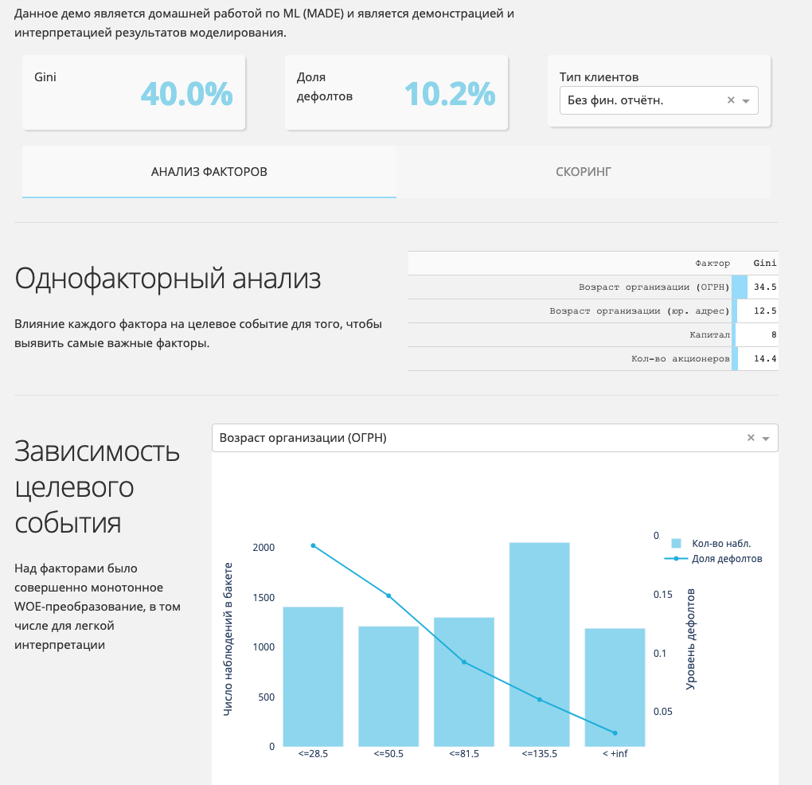
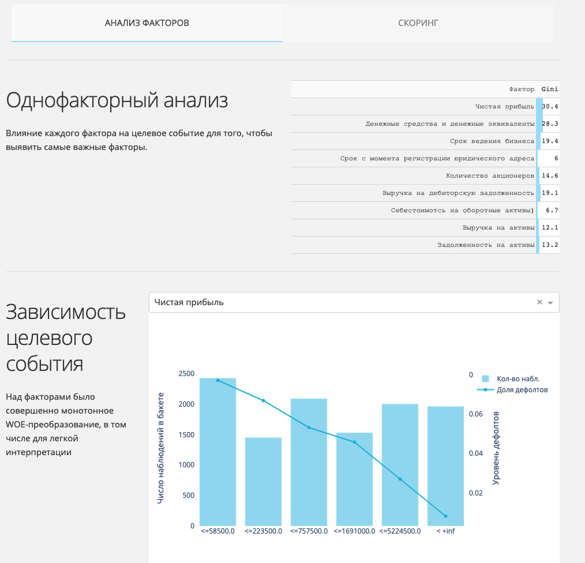
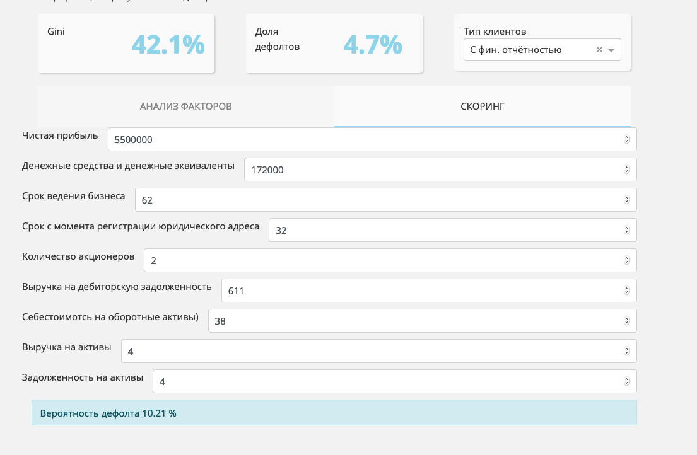

# ML_HW4
Предсказание дефолта
Разработчики:

Иванов А.В. и Горяев А.Ф.
Модель предсказывет вероятность возврата кредита заёмщиком на основе финансовых данных 32 395 компаний (выручка, активы, пассивы и т.д).

Данное демо является домашней работой по ML (MADE) и является демонстрацией и интерпретацией результатов моделирования.

- [демо][1]
- [исходный код данного демо][2]
- [код разработки модели][3]

[1]: https://madehw4ml.herokuapp.com/
[2]: https://github.com/made-hw/ML_HW4/tree/master/demo
[3]: https://github.com/made-hw/ML_HW4/blob/master/Solution_and_presenattion.ipynb

Скриншоты демо:

---

---

---